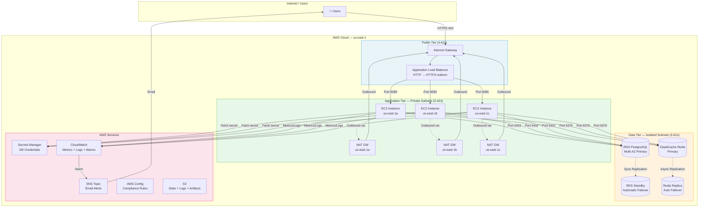
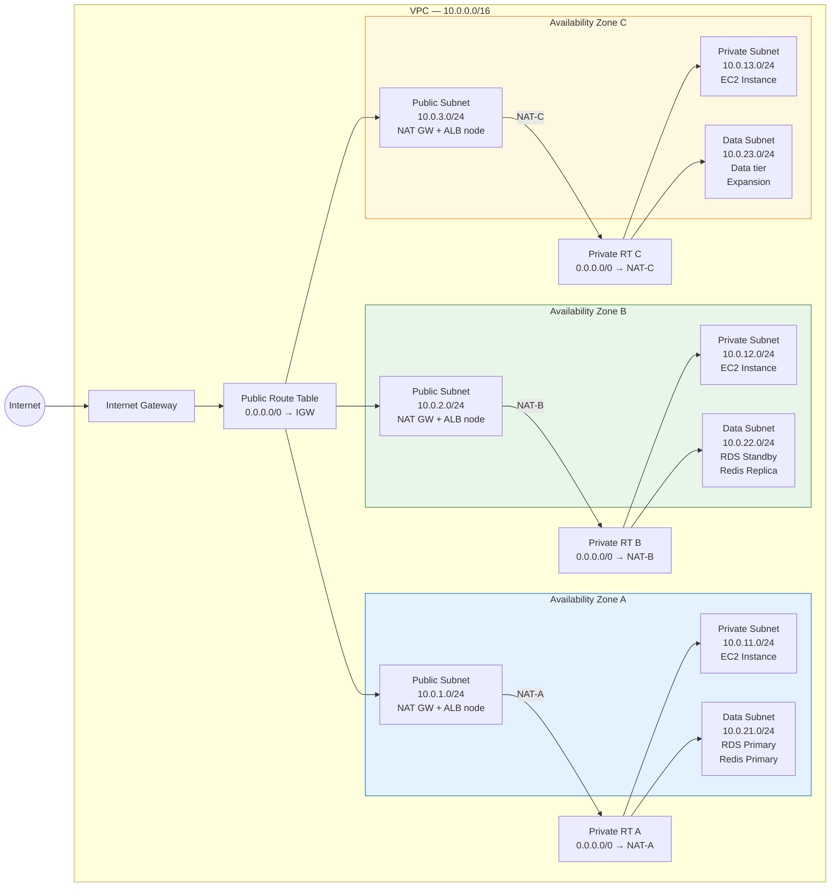
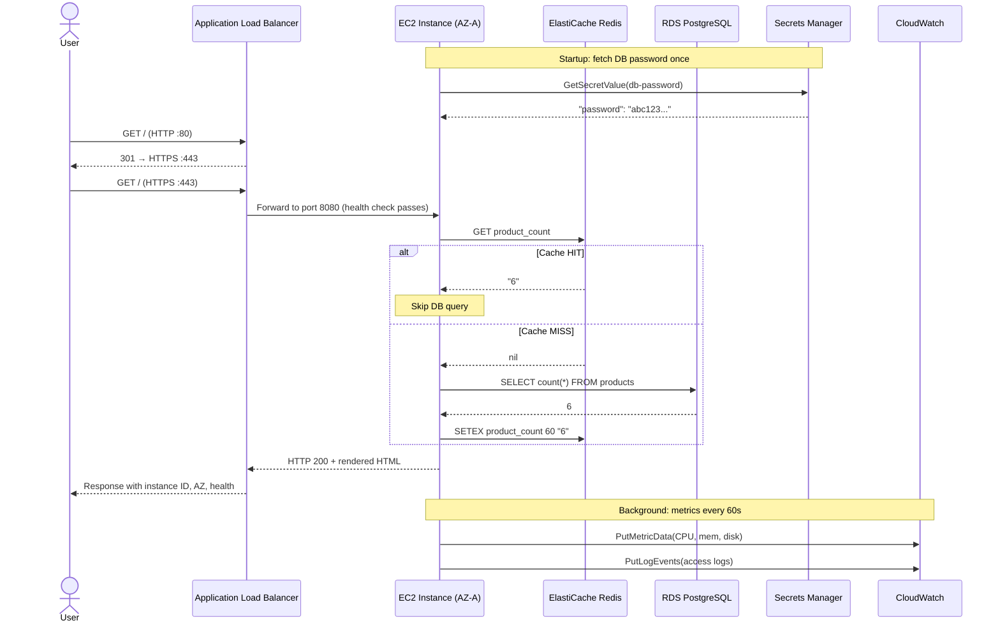
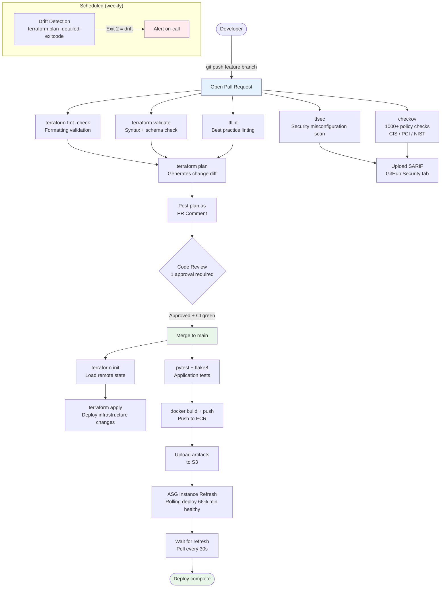
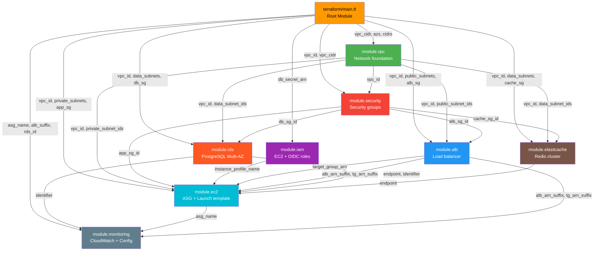
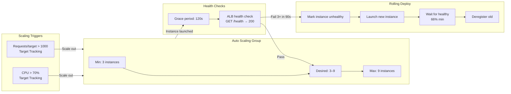
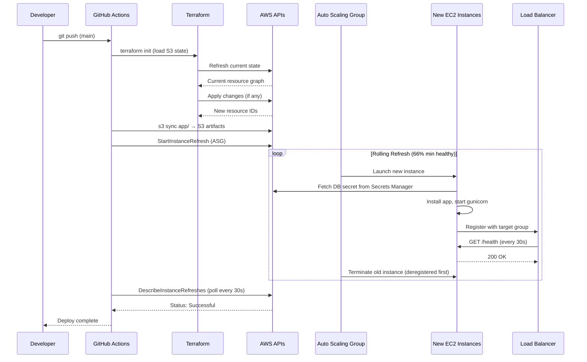

# AWS Ecommerce Infrastructure

Production-grade AWS infrastructure for a multi-tier ecommerce application, built with Terraform and deployed via GitHub Actions. Designed to demonstrate all aspects of a modern cloud platform: networking, compute, database, caching, CI/CD, observability, security, and cost management.

---

## Table of Contents

- [Architecture Overview](#architecture-overview)
- [Network Topology](#network-topology)
- [Request Flow](#request-flow)
- [CI/CD Pipeline](#cicd-pipeline)
- [Terraform Module Graph](#terraform-module-graph)
- [Auto Scaling Flow](#auto-scaling-flow)
- [Deployment Sequence](#deployment-sequence)
- [Quick Start](#quick-start)
- [Project Structure](#project-structure)
- [Requirements Coverage](#requirements-coverage)
- [Monitoring & Alerting](#monitoring--alerting)
- [Security](#security)
- [Cost](#cost)

---

## Architecture Overview



---

## Network Topology



> **Why one NAT Gateway per AZ?** Cross-AZ NAT traffic costs $0.01/GB and creates an HA dependency. One NAT per AZ eliminates both the cost leak and the single point of failure.

---

## Request Flow



---

## CI/CD Pipeline



---

## Terraform Module Graph



---

## Auto Scaling Flow



---

## Deployment Sequence



---

## Quick Start

### Prerequisites

- AWS CLI configured with appropriate credentials
- Terraform >= 1.5.0
- GitHub CLI (`gh`)

### 1. Bootstrap Remote State

```bash
# Creates S3 bucket + DynamoDB lock table (run once)
chmod +x scripts/setup-backend.sh
./scripts/setup-backend.sh us-east-1
```

**What this does:**
1. Creates `rizwan66-terraform-state` S3 bucket with versioning + encryption
2. Blocks all public access on the bucket
3. Creates `rizwan66-terraform-locks` DynamoDB table for state locking

### 2. Add GitHub Secrets

In your repository → Settings → Secrets and variables → Actions:

| Secret | Description | How to get |
|--------|-------------|------------|
| `AWS_ROLE_ARN` | GitHub Actions IAM role ARN | From `terraform output` after first apply (bootstrap) |
| `ALERT_EMAIL` | Email for CloudWatch alert notifications | Your email address |

### 3. First Deployment

```bash
cd terraform

# Initialize — downloads providers, connects to remote state
terraform init

# Preview all changes before applying
terraform plan \
  -var="alert_email=you@example.com" \
  -out=tfplan

# Apply (creates ~50 AWS resources)
terraform apply tfplan
```

**Estimated apply time: 15–25 minutes** (RDS Multi-AZ takes the longest)

### 4. Access the Application

```bash
# Get the ALB DNS name
terraform output alb_dns_name
# → ecommerce-prod-alb-1234567890.us-east-1.elb.amazonaws.com

# Visit in browser
open http://$(terraform output -raw alb_dns_name):8080

# Check health endpoint
curl http://$(terraform output -raw alb_dns_name):8080/health | jq .
```

### 5. GitOps Workflow (after initial setup)

```bash
# All future changes via Pull Request
git checkout -b feature/my-change
# ... edit terraform/ files ...
git push origin feature/my-change
# Open PR → CI runs plan → review → merge → auto-apply
```

---

## Project Structure

```
aws-ecommerce-infra/
│
├── terraform/                    # Infrastructure as Code
│   ├── main.tf                   # Root module: wires all sub-modules together
│   ├── variables.tf              # All input variables with descriptions + validation
│   ├── outputs.tf                # Key outputs (ALB DNS, dashboard URL, etc.)
│   ├── versions.tf               # Provider version constraints + default tags
│   ├── backend.tf                # S3 remote state + DynamoDB locking
│   │
│   └── modules/
│       ├── vpc/                  # Network foundation
│       │   ├── main.tf           #   VPC, 9 subnets, 3 NAT GWs, route tables, flow logs
│       │   ├── variables.tf      #   CIDR blocks, AZs, name prefix
│       │   └── outputs.tf        #   vpc_id, subnet ID lists, nat_gateway_ids
│       │
│       ├── security/             # Security groups (least privilege)
│       │   ├── main.tf           #   ALB SG (80/443), App SG (8080←ALB), DB SG (5432←App)
│       │   ├── variables.tf
│       │   └── outputs.tf        #   alb_sg_id, app_sg_id, db_sg_id, cache_sg_id
│       │
│       ├── alb/                  # Application Load Balancer
│       │   ├── main.tf           #   ALB, target group, listeners, S3 access logs
│       │   ├── variables.tf
│       │   └── outputs.tf        #   dns_name, zone_id, arn_suffix, tg_arn
│       │
│       ├── ec2/                  # Compute: Launch Template + Auto Scaling
│       │   ├── main.tf           #   Launch template (IMDSv2, gp3, CW agent), ASG, 2 scaling policies
│       │   ├── user_data.sh.tpl  #   Bootstrap: install app, fetch secret, start gunicorn
│       │   ├── variables.tf
│       │   └── outputs.tf        #   asg_name, launch_template_id
│       │
│       ├── rds/                  # Database: PostgreSQL Multi-AZ
│       │   ├── main.tf           #   RDS instance, subnet group, parameter group, monitoring role
│       │   ├── variables.tf
│       │   └── outputs.tf        #   endpoint (sensitive), identifier, port
│       │
│       ├── elasticache/          # Cache: Redis replication group
│       │   ├── main.tf           #   Redis 7.1, subnet group, parameter group, encryption
│       │   ├── variables.tf
│       │   └── outputs.tf        #   endpoint (sensitive), reader_endpoint, port
│       │
│       ├── iam/                  # Identity & Access Management
│       │   ├── main.tf           #   EC2 role (least-priv), GitHub Actions OIDC role, instance profile
│       │   ├── variables.tf
│       │   └── outputs.tf        #   instance_profile_name, github_actions_role_arn
│       │
│       └── monitoring/           # Observability & Compliance
│           ├── main.tf           #   Dashboard (8 widgets), 5 alarms, SNS, Config recorder + 3 rules
│           ├── variables.tf
│           └── outputs.tf        #   dashboard_url, sns_topic_arn
│
├── app/                          # Flask Application
│   ├── app.py                    # Routes: /, /health, /api/products, /api/cart, /metrics
│   ├── requirements.txt          # Python dependencies
│   ├── Dockerfile                # Container image (non-root user)
│   ├── templates/
│   │   └── index.html            # UI: instance info + product catalogue + cart
│   └── tests/
│       ├── conftest.py           # pytest fixtures (mock Redis, DB, config)
│       ├── test_health.py        # /health endpoint tests
│       ├── test_products.py      # Product API tests
│       ├── test_cart.py          # Cart API tests
│       └── test_metrics.py       # /metrics endpoint tests
│
├── tests/terratest/              # Infrastructure tests (Go)
│   ├── go.mod
│   ├── vpc_test.go               # VPC multi-AZ, subnet count, NAT GW assertions
│   ├── security_test.go          # Security group least-privilege assertions
│   ├── alb_test.go               # ALB health check, target group config
│   └── integration_test.go       # End-to-end: deploy → HTTP request → verify response
│
├── .github/workflows/
│   ├── terraform.yml             # IaC pipeline: fmt→validate→lint→scan→plan→apply→drift
│   └── app-deploy.yml            # App pipeline: test→build→push→ASG refresh
│
├── scripts/
│   ├── setup-backend.sh          # Bootstrap S3 state + DynamoDB lock table
│   └── drift-detection.sh        # Detect infrastructure drift vs state
│
├── docs/
│   ├── architecture.md           # Full architecture with diagrams
│   ├── modules.md                # Per-module explanation + variable reference
│   ├── cicd-pipeline.md          # CI/CD deep dive
│   ├── security.md               # Security posture + CIS compliance mapping
│   ├── cost-optimization.md      # Cost breakdown + 5 strategies
│   ├── disaster-recovery.md      # DR runbook: AZ + region failover
│   └── runbook.md                # Day-2 operations guide
│
├── .gitignore
└── README.md
```

---

## Requirements Coverage

| Requirement | Grade Weight | Implementation | Location |
|-------------|-------------|----------------|----------|
| **Infrastructure Foundation (15%)** | | | |
| Terraform IaC (organized, modular) | | 7 modules, consistent structure | `terraform/modules/` |
| Remote state management | | S3 + DynamoDB lock | `terraform/backend.tf` |
| Variables and outputs | | Full definitions with descriptions + validation | `*/variables.tf`, `*/outputs.tf` |
| Modules for reusability | | All 7 modules parametrised | `terraform/modules/*/` |
| Version control with commits | | Git history with descriptive commits | `.git/` |
| VPC with public/private subnets | | 3 + 3 + 3 subnets across 3 AZs | `modules/vpc/main.tf` |
| Multi-AZ deployment | | All tiers span 3 AZs | `variables.tf:availability_zones` |
| NAT Gateway for private subnets | | One per AZ (HA) | `modules/vpc/main.tf:aws_nat_gateway` |
| Least-privilege security groups | | 4 SGs, strict tier isolation | `modules/security/main.tf` |
| Network tier isolation | | Public/App/Data tiers | `modules/vpc/main.tf` |
| **Application Platform (15%)** | | | |
| Load-balanced multi-tier app | | ALB + ASG + RDS + Redis | `modules/alb/`, `modules/ec2/` |
| Minimum 3 instances across AZs | | min_size=3, 3 private subnets | `variables.tf:app_min_size` |
| Health checks configured | | ALB `/health` check, ELB health type | `modules/alb/main.tf:aws_lb_target_group` |
| Tier separation | | Public → App → Data | Network architecture |
| Python ecommerce app | | Flask with catalogue + cart | `app/app.py` |
| Instance ID, AZ, health display | | In both `/` and `/health` | `app/app.py:health()`, `index.html` |
| `/health` endpoint | | Returns JSON dependency status | `app/app.py:health()` |
| Database/cache connected | | RDS PostgreSQL + Redis | `app/app.py:_check_db()` |
| **CI/CD & Automation (15%)** | | | |
| GitHub Actions configured | | 2 workflows | `.github/workflows/` |
| Automated Terraform validation | | fmt + validate + tflint | `terraform.yml:validate` |
| Automated testing | | tfsec + checkov + Terratest | `terraform.yml:security-scan` |
| Deploy on merge to main | | `apply` job gated on main | `terraform.yml:apply` |
| Infrastructure via GitOps | | All changes via PR + merge | Workflow design |
| PR workflow | | Required status checks | Branch protection |
| Branch protection rules | | 1 approval + CI green | GitHub settings |
| Automated linting/formatting | | tflint + flake8 | Both workflows |
| Drift detection | | Scheduled plan + exit code 2 | `terraform.yml:drift-detection` |
| **Observability & Monitoring (10%)** | | | |
| CloudWatch monitoring | | Dashboard + metrics + logs | `modules/monitoring/main.tf` |
| Custom dashboard | | 8-widget dashboard | `aws_cloudwatch_dashboard` |
| Application + infra metrics | | CloudWatch agent on EC2 + RDS metrics | `user_data.sh.tpl` |
| Log aggregation | | App logs + VPC Flow Logs + ALB access logs | Multiple log groups |
| 3+ alerts configured | | 5 alarms | `modules/monitoring/main.tf` |
| Alert thresholds | | CPU 85%, 5xx > 10, storage < 5GB | Alarm resources |
| Notification channels | | SNS → Email | `aws_sns_topic_subscription` |
| **Security & Compliance (10%)** | | | |
| AWS Config compliance tool | | Recorder + 3 managed rules | `modules/monitoring/main.tf` |
| Security scanning in pipeline | | tfsec + checkov + SARIF | `terraform.yml:security-scan` |
| No hardcoded secrets | | Secrets Manager + OIDC | `main.tf:aws_secretsmanager_secret` |
| IAM least privilege | | Scoped EC2 role + OIDC for CI | `modules/iam/main.tf` |
| Security groups properly configured | | Strict tier-to-tier rules only | `modules/security/main.tf` |
| Security posture documented | | CIS mapping, risk assessment | `docs/security.md` |
| **Cost Optimization (5%)** | | | |
| Cost allocation tags | | 5 tags on all resources | `versions.tf:default_tags` |
| Monthly cost projection | | ~$275/month breakdown | `docs/cost-optimization.md` |
| 3+ optimization strategies | | Savings Plans, Spot, VPC endpoints, scheduling, S3 IT | `docs/cost-optimization.md` |
| **Advanced Requirements** | | | |
| Disaster Recovery | | Multi-AZ auto + cross-region runbook | `docs/disaster-recovery.md` |
| Infrastructure Testing | | Terratest suite | `tests/terratest/` |
| FinOps Dashboard | | CloudWatch 8-widget + cost tags | `modules/monitoring/` |

---

## Monitoring & Alerting

### CloudWatch Dashboard (8 Widgets)

| Widget | Metric | Purpose |
|--------|--------|---------|
| ALB Request Count | `RequestCount` | Traffic volume |
| ALB Response Time P99 | `TargetResponseTime p99` | User experience |
| ALB 5xx Errors | `HTTPCode_ELB_5XX_Count` | Error rate |
| ASG Instance Count | `GroupInServiceInstances` | Capacity |
| ASG CPU Utilization | `CPUUtilization` | Compute health |
| RDS CPU + Connections | `CPUUtilization`, `DatabaseConnections` | DB health |
| Healthy Host Count | `HealthyHostCount` | ALB target health |
| RDS Free Storage | `FreeStorageSpace` | Storage alert |

### 5 Configured Alarms

| Alarm | Threshold | Periods | Action |
|-------|-----------|---------|--------|
| ALB 5xx errors | > 10/min | 2× 60s | SNS → Email |
| ASG CPU high | > 85% avg | 3× 60s | SNS → Email |
| Unhealthy hosts | > 0 | 1× 60s | SNS → Email |
| RDS CPU high | > 80% avg | 3× 60s | SNS → Email |
| RDS storage low | < 5 GB | 1× 300s | SNS → Email |

---

## Security

See [docs/security.md](docs/security.md) for the full posture document.

**Key controls at a glance:**
- Zero hardcoded secrets — all via AWS Secrets Manager
- GitHub Actions uses OIDC federation — no static AWS access keys
- IMDSv2 enforced on all EC2 instances (hop limit = 1)
- All EBS volumes, RDS, and Redis encrypted at rest
- VPC Flow Logs capture all traffic (30-day retention)
- Security groups enforce strict least-privilege tier isolation
- AWS Config continuously monitors 3 compliance rules
- tfsec + checkov scan every PR (SARIF → GitHub Security tab)

---

## Cost

**Estimated: ~$275/month** (us-east-1, On-Demand pricing)
**With 1-year Savings Plans: ~$200/month**

See [docs/cost-optimization.md](docs/cost-optimization.md) for:
- Full line-item breakdown
- 5 optimization strategies with code examples
- Cost/performance trade-off analysis
- FinOps dashboard description

---

Infrastructure by **rizwan66** | Managed by Terraform | CI/CD via GitHub Actions
