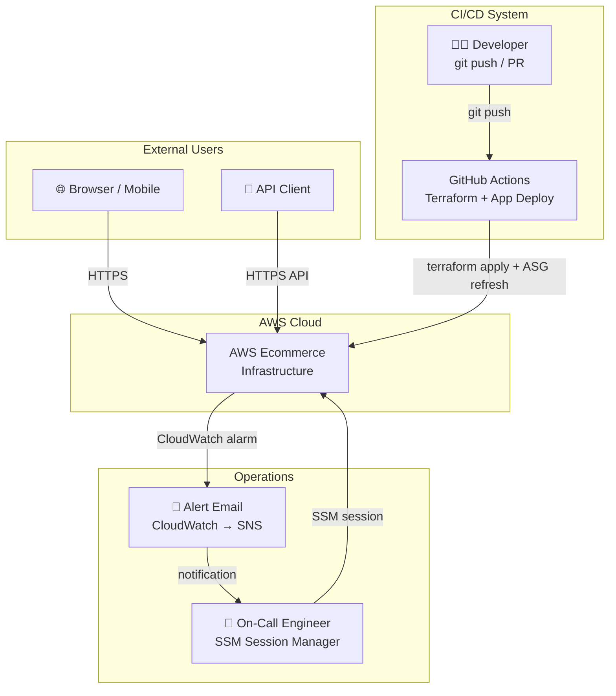
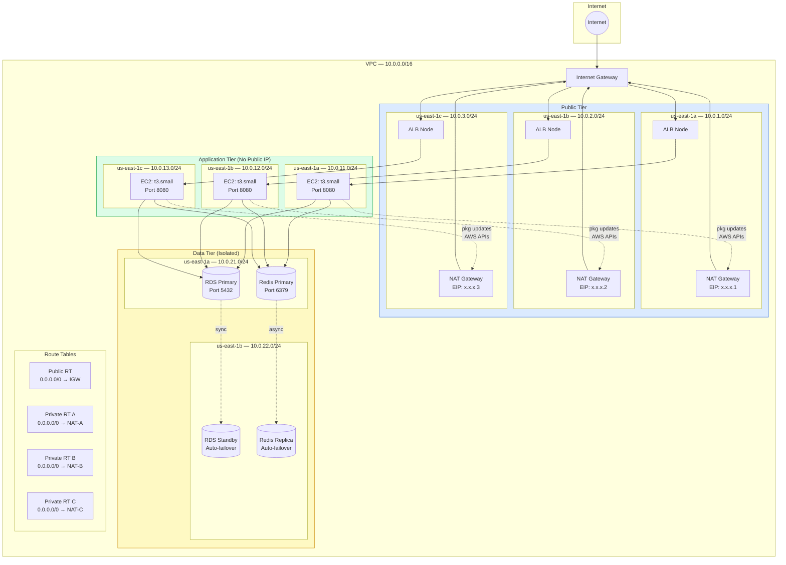
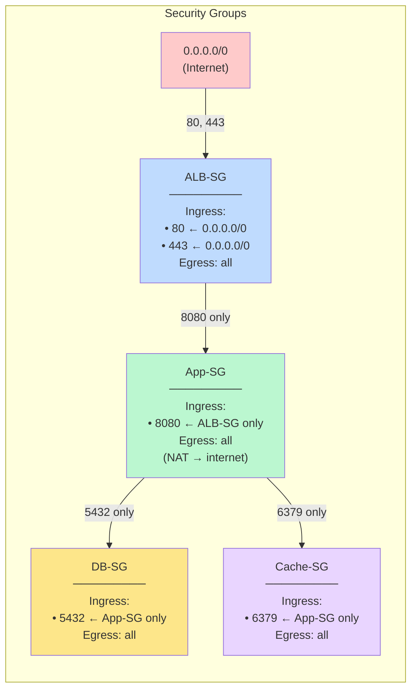
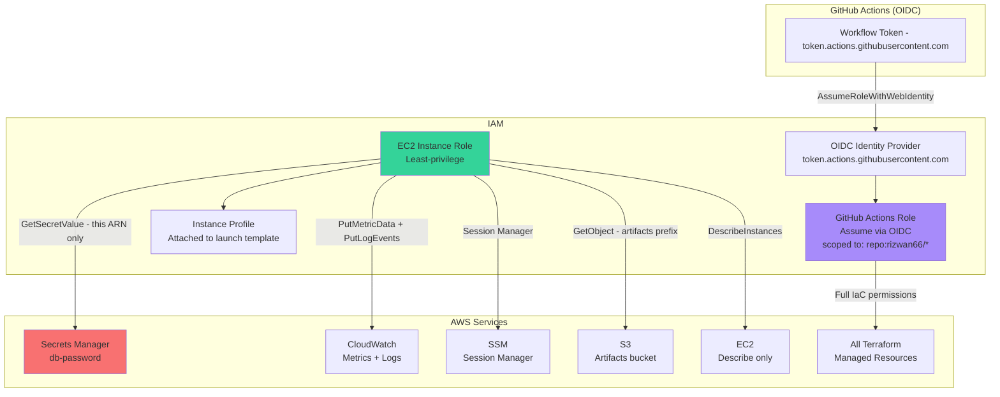
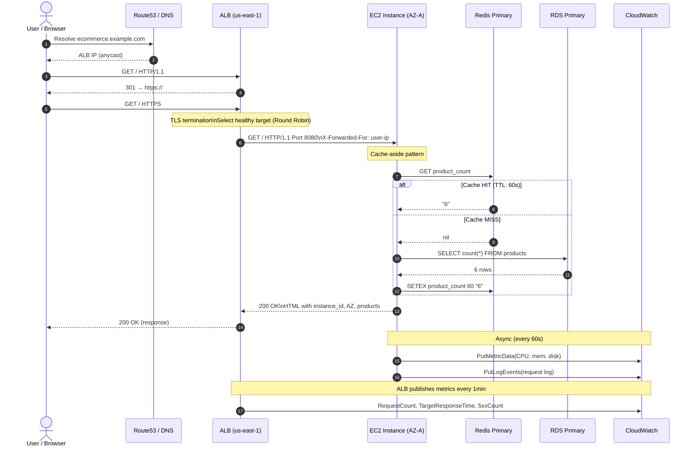
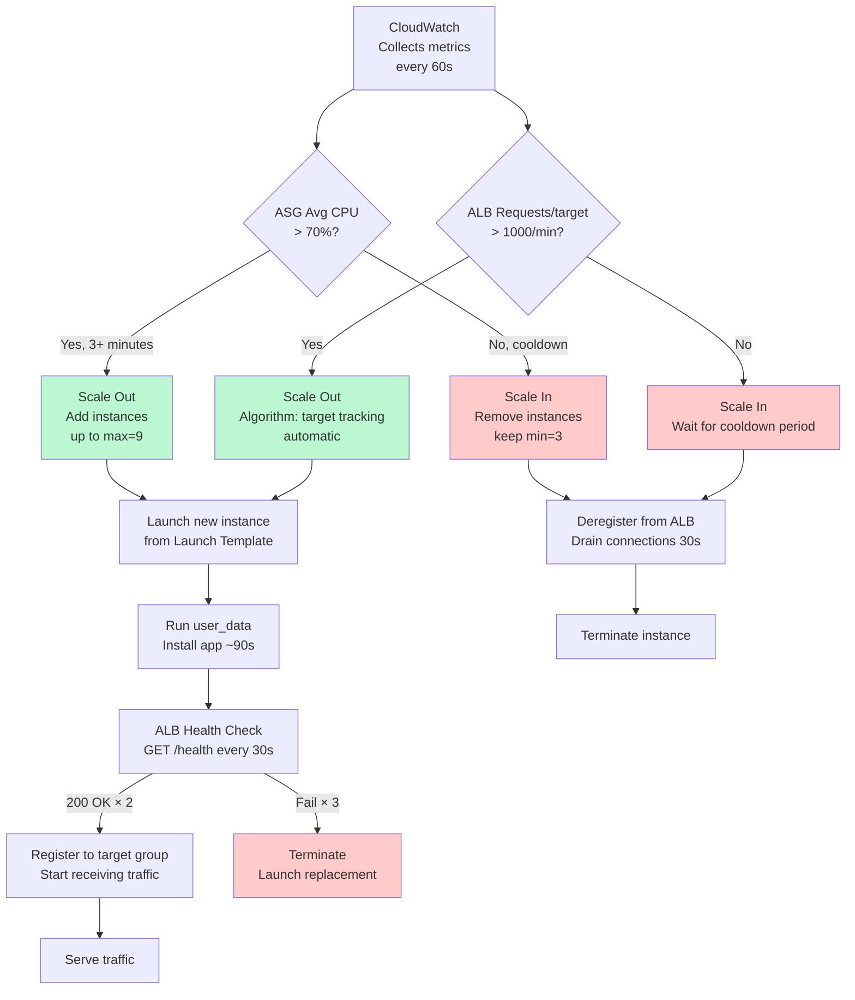
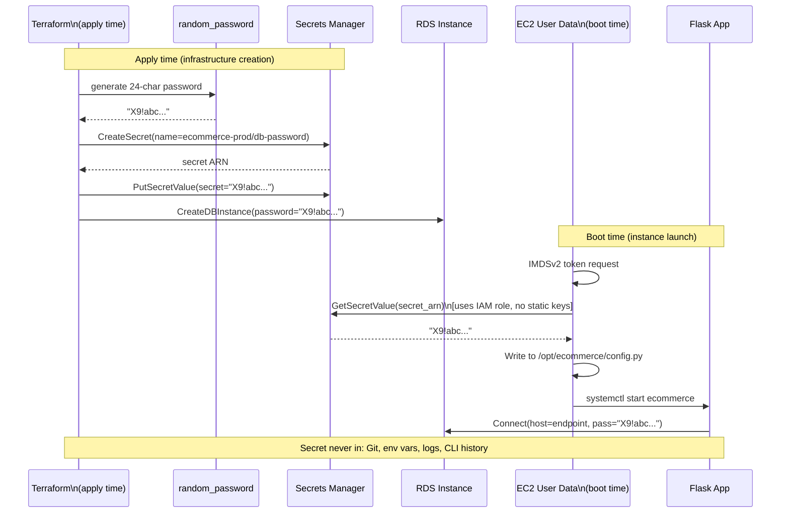
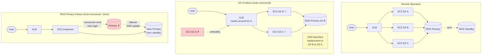
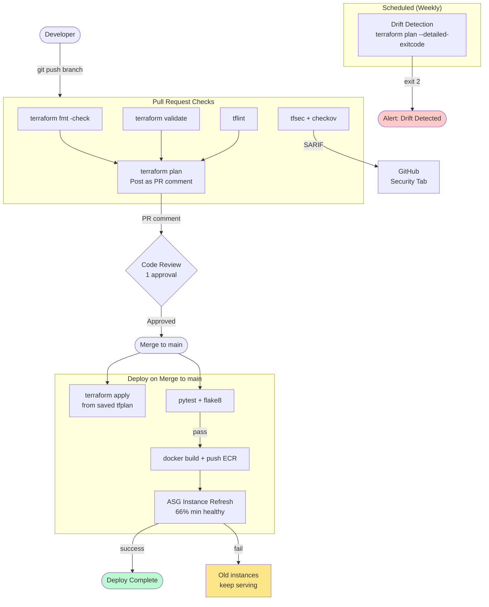

# Architecture Documentation

Full technical architecture with diagrams, design rationale, and component explanations.

---

## System Context



---

## Network Architecture



---

## Security Group Rules



**Key security property:** There is no direct path from the internet to the database or cache. Traffic must traverse both the ALB (TLS termination) and the EC2 application tier.

---

## IAM Permission Model



---

## Application Request Flow (Detailed)



---

## Auto Scaling Decision Tree



---

## Data Flow: Secrets Management



---

## High Availability Failure Scenarios



---

## Monitoring Architecture

```mermaid
graph TB
    subgraph Sources["Metric Sources"]
        ALB_M[ALB Metrics\nRequestCount\nResponseTime\n5xx errors]
        ASG_M[ASG Metrics\nInstance count\nCPU utilization]
        RDS_M[RDS Metrics\nCPU, Connections\nFreeStorage]
        APP_M[App Metrics\nCustom via CW Agent\nCPU, mem, disk]
        LOG_M[Logs\nApp logs\nVPC Flow Logs\nALB Access Logs]
    end

    subgraph CW["CloudWatch"]
        DASH[Dashboard\n8 widgets]
        ALARMS[5 Alarms\nEvaluate continuously]
        CW_LOGS[Log Groups\nRetention 14-30 days]
    end

    subgraph Config["AWS Config"]
        REC[Configuration Recorder\nAll resources]
        RULES[3 Compliance Rules\nEncryption, IAM policy]
        S3_CFG[S3 Snapshot Bucket\nEncrypted]
    end

    subgraph Notification["Alerting"]
        SNS[SNS Topic]
        EMAIL[Email\nalerts@example.com]
    end

    ALB_M & ASG_M & RDS_M & APP_M --> CW
    LOG_M --> CW_LOGS
    ALARMS -->|threshold breach| SNS
    ALARMS -->|recovery| SNS
    SNS --> EMAIL
    REC --> RULES
    REC --> S3_CFG
    CW --> DASH

    style ALARMS fill:#fde68a
    style SNS fill:#f87171
    style EMAIL fill:#f87171
```

---

## CI/CD Pipeline Flow



---

## Component Sizing (Production)

| Component | Configuration | Purpose |
|-----------|--------------|---------|
| VPC | /16 (65,536 IPs) | Room for growth |
| Public subnets | /24 each × 3 | 254 IPs per AZ (ALB + future) |
| Private subnets | /24 each × 3 | 254 IPs per AZ (EC2 fleet) |
| Data subnets | /24 each × 3 | 254 IPs per AZ (DB + cache) |
| EC2 instances | t3.small (2 vCPU, 2GB) | Burstable; web/API workload |
| ASG | min=3, desired=3, max=9 | 3× scale headroom |
| RDS | db.t3.medium (2 vCPU, 4GB) | Burstable; OLTP workload |
| RDS storage | 20GB gp3, auto-scale to 40GB | Consistent 3000 IOPS |
| ElastiCache | cache.t3.micro × 2 | Session + cache data |
| Redis max memory | LRU eviction policy | Cache workload optimized |

---

## Technology Decisions

| Decision | Alternative Considered | Rationale |
|----------|----------------------|-----------|
| Terraform (HCL) | CDK, Pulumi | Industry standard; most cloud job postings |
| S3 + DynamoDB state | Terraform Cloud | No external service dependency; free |
| GitHub Actions | Jenkins, CircleCI | Native to GitHub; OIDC support |
| Flask | FastAPI, Django | Minimal; easy to understand; focus on infra |
| PostgreSQL 16 | MySQL, Aurora | Open standard; `psycopg2` widely used |
| Redis 7.1 | Memcached, DynamoDB | Supports data structures; TTL per key |
| Amazon Linux 2023 | Ubuntu, CentOS | AWS-optimized; dnf; free security patches |
| gunicorn | uwsgi, uvicorn | Flask-native; simple configuration |
| gp3 over gp2 | gp2 | Same price, better baseline IOPS |
| NAT per AZ | Single NAT | HA + avoid cross-AZ data transfer cost |
