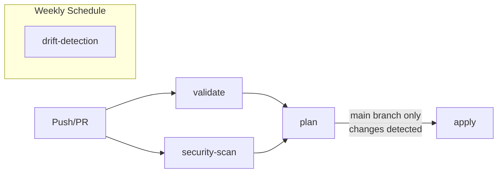

# CI/CD Pipeline Deep Dive

Two GitHub Actions workflows manage the full lifecycle: infrastructure changes and application deployments.

---

## Workflow 1: Infrastructure (terraform.yml)

### Trigger conditions

| Event | Jobs triggered |
|-------|---------------|
| Push to `main` (terraform/** changed) | validate → security-scan → plan → apply |
| Pull request to `main` (terraform/** changed) | validate → security-scan → plan (no apply) |
| `workflow_dispatch` | Manual run with action choice |
| `schedule` (weekly) | drift-detection only |

### Job dependency graph



### Job 1: validate

**Purpose:** Catch syntax errors and style violations before running a plan.

```
Steps:
  1. actions/checkout@v4
  2. hashicorp/setup-terraform@v3 (v1.9.0)
  3. terraform fmt -check -recursive -diff      ← fails if any file needs reformatting
  4. aws-actions/configure-aws-credentials@v4   ← OIDC auth (needed for providers)
  5. terraform init -backend=false              ← loads providers, skips state
  6. terraform validate                          ← checks HCL syntax + schema
  7. tflint --init && tflint --recursive        ← best practice linting
```

**What tflint catches (examples):**
- Deprecated resource arguments
- Instance types that don't exist in the target region
- Missing required tags
- Unused variables

### Job 2: security-scan

**Purpose:** Catch security misconfigurations before infrastructure is touched.

```
Steps:
  1. tfsec scan:
     - Open security groups (0.0.0.0/0 on DB ports)
     - Unencrypted S3 buckets
     - Missing MFA on IAM
     - IMDSv1 in use (hop limit > 1)

  2. checkov scan:
     - 1000+ checks across CIS, PCI-DSS, HIPAA, NIST
     - IAM policy wildcards
     - Public RDS snapshots
     - CloudTrail logging gaps

  3. Upload SARIF to GitHub Security tab
     - Results visible under Security → Code scanning
     - Persisted across PRs for trend analysis
```

**Both tools use `soft_fail: true`** — they report findings but don't block the pipeline. This allows gradual remediation without stopping all deployments. Remove `soft_fail` once baseline issues are resolved.

### Job 3: plan

**Purpose:** Show exactly what will change before it changes.

```
Steps:
  1. terraform init              ← loads real remote state from S3
  2. terraform plan -out=tfplan  ← generates binary plan
     -detailed-exitcode          ← exit 0=no changes, 1=error, 2=changes
  3. Upload tfplan artifact      ← used by apply job (7-day retention)
  4. Post plan output as PR comment
```

**Why save the plan artifact?**
The apply job downloads and applies the **exact** plan from the plan job. This prevents TOCTOU (time-of-check-time-of-use) issues where state changes between plan and apply could result in different actions being taken.

**Exit code handling:**
```
exitcode=0 → No changes, apply job skipped
exitcode=1 → Error, pipeline fails
exitcode=2 → Changes pending, apply job runs
```

### Job 4: apply

**Conditions:** `github.ref == 'refs/heads/main'` AND `plan_exitcode == '2'`

```
Steps:
  1. terraform init           ← reconnect to state
  2. Download tfplan artifact ← the exact plan from job 3
  3. terraform apply tfplan   ← no re-plan, apply the saved plan
  4. terraform output -json   ← log all outputs for reference
```

**GitHub Environment: `production`**
The apply job runs in the `production` environment, which can be configured with:
- Required reviewers (manual approval gate)
- Deployment protection rules
- Environment-specific secrets

### Job 5: drift-detection (scheduled)

**Runs weekly.** Detects when someone has made manual changes to AWS resources outside of Terraform.

```bash
terraform plan -detailed-exitcode
exit 0  → no drift
exit 2  → drift detected → pipeline fails → GitHub sends failure notification
```

---

## Workflow 2: Application (app-deploy.yml)

### Trigger conditions

| Event | Jobs triggered |
|-------|---------------|
| Push to `main` (app/** changed) | test → build-push → deploy |
| Pull request to `main` (app/** changed) | test only |

### Job 1: test

```
Steps:
  1. setup-python@v5 (3.12, pip cache)
  2. pip install requirements.txt + pytest + pytest-cov + flake8
  3. flake8 . --max-line-length=120    ← PEP 8 style check
  4. pytest tests/ -v --cov=app        ← unit tests with coverage
```

**Coverage requirements:**
The `--cov-report=xml` output can be uploaded to Codecov or checked against a minimum threshold by adding:
```yaml
- run: |
    COVERAGE=$(python -m coverage report --fail-under=80)
```

### Job 2: build-push

```
Steps:
  1. aws-actions/amazon-ecr-login@v2    ← authenticate to ECR
  2. docker/metadata-action@v5          ← generate tags (SHA + latest)
  3. docker/build-push-action@v5        ← build + push
     cache-from: type=gha               ← GitHub Actions cache (layer cache)
     cache-to: type=gha,mode=max        ← save all layers
```

**Image tags produced:**
- `<ECR_URI>/ecommerce-app:<git-sha>` — immutable, used for rollback
- `<ECR_URI>/ecommerce-app:latest` — points to current

### Job 3: deploy

```
Steps:
  1. aws s3 sync ./app s3://artifacts/app/   ← upload app code
  2. Get ASG name (by Project tag)
  3. StartInstanceRefresh                     ← rolling deploy begins
     MinHealthyPercentage = 66               ← at least 2/3 healthy
     InstanceWarmup = 120s                   ← wait for user_data to finish
  4. Poll DescribeInstanceRefreshes every 30s
     Status: Successful → exit 0 (success)
     Status: Failed     → exit 1 (fail pipeline, keep old instances)
     Timeout: 15 min    → exit 1
```

**Rollback:** If the refresh fails, AWS keeps the old instances running. The `Failed` status triggers the pipeline to exit 1, alerting the team while the old version continues serving traffic.

---

## Branch Protection Configuration

Applied to the `master` branch via GitHub API:

```json
{
  "required_status_checks": {
    "strict": true,
    "contexts": [
      "Lint & Validate",
      "Security Scan (tfsec + checkov)",
      "Terraform Plan"
    ]
  },
  "required_pull_request_reviews": {
    "required_approving_review_count": 1,
    "dismiss_stale_reviews": true
  },
  "restrictions": null
}
```

**`strict: true`** means the PR branch must be up-to-date with `master` before merging. This prevents "works in isolation" scenarios where two PRs conflict at merge time.

---

## GitHub Secrets Required

| Secret | Where used | Value |
|--------|-----------|-------|
| `AWS_ROLE_ARN` | Both workflows | ARN of GitHub Actions IAM role from `terraform output` |
| `ALERT_EMAIL` | terraform.yml | Email for CloudWatch SNS subscription |

**How to get `AWS_ROLE_ARN` (bootstrap):**
```bash
# One-time setup with local credentials
cd terraform
terraform init -backend=false
terraform apply -target=module.iam.aws_iam_role.github_actions
terraform output  # Note: github_actions_role_arn
```

---

## Adding a New Environment

To add a `staging` environment:

1. Create `terraform/environments/staging/main.tf`:
```hcl
module "staging" {
  source      = "../../"
  environment = "staging"

  # Reduced sizes for staging
  app_instance_count = 2
  app_min_size       = 1
  db_instance_class  = "db.t3.small"
  cache_node_type    = "cache.t2.micro"
}
```

2. Add a workspace:
```bash
terraform workspace new staging
terraform workspace select staging
terraform apply -var-file=staging.tfvars
```

3. Add a GitHub workflow that targets staging on push to `develop` branch.
