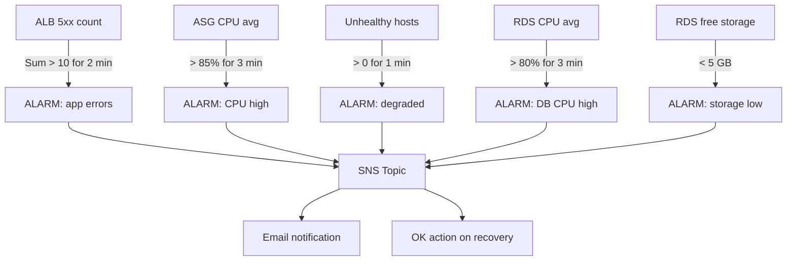

# Terraform Module Reference

Detailed explanation of every module: what it creates, why each resource exists, and the full variable/output reference.

---

## Table of Contents

- [Root Module](#root-module)
- [vpc](#vpc-module)
- [security](#security-module)
- [alb](#alb-module)
- [ec2](#ec2-module)
- [rds](#rds-module)
- [elasticache](#elasticache-module)
- [iam](#iam-module)
- [monitoring](#monitoring-module)

---

## Root Module

**File:** `terraform/main.tf`

The root module is the composition layer — it does not create any resources directly. Instead, it wires together all sub-modules by passing outputs from one as inputs to another. This is where the dependency graph is defined.

### Composition order

```
random_password ──────────────────────────────┐
                                               ▼
Secrets Manager ──────► IAM (scope secret)    EC2 (bootstrap)
                                               ▲
vpc ──► security ──► alb ──► ec2             RDS (endpoint)
         │                    ▲               ▲
         └───────────────────►│           ElastiCache
                              └───────────►
alb + ec2 + rds ──────────────────────────► monitoring
```

### Why random_password?

Terraform generates a cryptographically strong 24-character password at plan time, stores it in Secrets Manager (not in state in plaintext), and passes it to RDS. The password never appears in logs or Git history.

---

## VPC Module

**Path:** `terraform/modules/vpc/`

### What it creates

| Resource | Count | Purpose |
|----------|-------|---------|
| `aws_vpc` | 1 | Isolated network with DNS support |
| `aws_internet_gateway` | 1 | Outbound/inbound path for public subnets |
| `aws_subnet` (public) | 3 | ALB endpoints; auto-assign public IP |
| `aws_subnet` (private) | 3 | EC2 instances; no public IP |
| `aws_subnet` (data) | 3 | RDS + Redis; no public IP |
| `aws_eip` | 3 | Static IPs for NAT Gateways |
| `aws_nat_gateway` | 3 | Outbound internet for private/data tiers |
| `aws_route_table` (public) | 1 | 0.0.0.0/0 → IGW |
| `aws_route_table` (private) | 3 | 0.0.0.0/0 → NAT-{AZ} |
| `aws_route_table` (data) | 3 | 0.0.0.0/0 → NAT-{AZ} |
| `aws_route_table_association` | 9 | Bind each subnet to its route table |
| `aws_cloudwatch_log_group` | 1 | Flow log destination |
| `aws_iam_role` + policy | 1 | Allows VPC to write to CloudWatch |
| `aws_flow_log` | 1 | Captures ALL traffic in the VPC |

### Design decisions

**Why 3 data subnets?**
RDS Multi-AZ and ElastiCache subnet groups require subnets in at least 2 AZs. Using 3 ensures the data tier remains consistent with the rest of the architecture and leaves room for future expansion (e.g., adding a third read replica).

**Why separate data subnets from private subnets?**
Defense in depth. If the application tier is compromised, the data tier has its own subnet layer. Security group rules then enforce which exact ports are reachable. Two layers of isolation: subnet (no route between tiers) + security group (only allowed port).

**Why one NAT Gateway per AZ?**
A single NAT Gateway creates two problems:
1. If that AZ fails, all private subnets lose outbound internet access
2. Cross-AZ NAT traffic is billed at $0.01/GB

One NAT per AZ eliminates both. The extra cost (~$65/month for two extra NAT GWs) is worth the HA guarantee in production.

**Why VPC Flow Logs with ALL traffic?**
Security investigations require seeing both accepted and rejected traffic. Logging only REJECTED traffic misses lateral movement between subnets that is allowed by SG rules.

### Variables

| Variable | Type | Default | Description |
|----------|------|---------|-------------|
| `name_prefix` | string | required | Prefix for all resource names |
| `vpc_cidr` | string | required | VPC CIDR block (e.g., `10.0.0.0/16`) |
| `availability_zones` | list(string) | required | AZs to deploy into |
| `public_subnet_cidrs` | list(string) | required | One CIDR per AZ for public tier |
| `private_subnet_cidrs` | list(string) | required | One CIDR per AZ for app tier |
| `data_subnet_cidrs` | list(string) | required | One CIDR per AZ for data tier |

### Outputs

| Output | Type | Description |
|--------|------|-------------|
| `vpc_id` | string | Used by all other modules |
| `public_subnet_ids` | list(string) | Passed to ALB module |
| `private_subnet_ids` | list(string) | Passed to EC2 module |
| `data_subnet_ids` | list(string) | Passed to RDS + ElastiCache modules |
| `nat_gateway_ids` | list(string) | Available for reference |

---

## Security Module

**Path:** `terraform/modules/security/`

### What it creates

4 security groups with strict least-privilege rules:

```
Internet (0.0.0.0/0)
    │ 80, 443
    ▼
┌─────────────┐
│   ALB SG    │
└──────┬──────┘
       │ 8080 (only from ALB SG)
       ▼
┌─────────────┐
│   App SG    │
└──────┬──────┘
       │ 5432 (only from App SG)          │ 6379 (only from App SG)
       ▼                                  ▼
┌─────────────┐                    ┌─────────────┐
│    DB SG    │                    │  Cache SG   │
└─────────────┘                    └─────────────┘
```

### Security group rules explained

**ALB SG:**
- Ingress 80 from `0.0.0.0/0` — HTTP (redirects to HTTPS)
- Ingress 443 from `0.0.0.0/0` — HTTPS
- Egress all — Required to forward to EC2 instances

**App SG:**
- Ingress 8080 from `alb_sg_id` only — Never directly from internet
- Egress all — Required for: package updates via NAT, Secrets Manager API, CloudWatch API, RDS, Redis

**DB SG:**
- Ingress 5432 from `app_sg_id` only — Postgresql; no other source
- No SSH (22), no public access

**Cache SG:**
- Ingress 6379 from `app_sg_id` only — Redis; no other source

### Why no SSH?

EC2 instances use **SSM Session Manager** (enabled via the EC2 IAM role). This means:
- No port 22 ever open
- No SSH keys to manage or rotate
- Full audit log of all sessions in CloudWatch
- Works from private subnets without a bastion host

### Variables

| Variable | Type | Description |
|----------|------|-------------|
| `name_prefix` | string | Resource name prefix |
| `vpc_id` | string | VPC to create SGs in |
| `vpc_cidr` | string | Available for future intra-VPC rules |

### Outputs

| Output | Description |
|--------|-------------|
| `alb_sg_id` | Passed to ALB module |
| `app_sg_id` | Passed to EC2 module |
| `db_sg_id` | Passed to RDS module |
| `cache_sg_id` | Passed to ElastiCache module |

---

## ALB Module

**Path:** `terraform/modules/alb/`

### What it creates

| Resource | Purpose |
|----------|---------|
| `aws_lb` | Application Load Balancer (internet-facing) |
| `aws_lb_target_group` | Pool of EC2 instances; health checks `/health` |
| `aws_lb_listener` (port 80) | Redirect HTTP → HTTPS (301) |
| `aws_lb_listener` (port 8080) | Forward to target group (demo; replace with HTTPS) |
| `aws_s3_bucket` (alb_logs) | Access log storage |
| `aws_s3_bucket_server_side_encryption_configuration` | Encrypt logs at rest |
| `aws_s3_bucket_public_access_block` | Block all public access |
| `aws_s3_bucket_policy` | Allow ELB service account to write logs |

### Health check configuration

```
Target group health check:
  Path:               /health
  Port:               traffic-port (8080)
  Protocol:           HTTP
  Healthy threshold:  2 consecutive 200s
  Unhealthy:          3 consecutive failures
  Timeout:            5 seconds
  Interval:           30 seconds
  Deregistration:     30 seconds (drains connections before removing)
```

The `/health` endpoint in the Flask app checks both RDS and Redis connectivity. If the database is unhealthy, the instance is deregistered from the ALB and a CloudWatch alarm fires.

### Access Logs

ALB access logs capture every request (method, URI, status, latency, client IP, target IP). They are stored in S3 with:
- Server-side encryption (AES-256)
- All public access blocked
- S3 bucket policy scoped to the ELB service account ARN only

### Variables

| Variable | Type | Description |
|----------|------|-------------|
| `name_prefix` | string | Resource name prefix |
| `vpc_id` | string | VPC for target group |
| `public_subnet_ids` | list(string) | Subnets ALB spans |
| `alb_sg_id` | string | Security group from security module |

### Outputs

| Output | Description |
|--------|-------------|
| `alb_dns_name` | Public DNS name for the load balancer |
| `alb_zone_id` | For Route53 alias records |
| `alb_arn_suffix` | Used by CloudWatch metric dimensions |
| `target_group_arn` | Passed to EC2 module (ASG registration) |
| `tg_arn_suffix` | Used by CloudWatch metric dimensions |

---

## EC2 Module

**Path:** `terraform/modules/ec2/`

### What it creates

| Resource | Purpose |
|----------|---------|
| `aws_launch_template` | Reusable instance configuration blueprint |
| `aws_autoscaling_group` | Manages desired/min/max fleet across AZs |
| `aws_autoscaling_policy` (CPU) | Scale when average CPU > 70% |
| `aws_autoscaling_policy` (RPS) | Scale when requests/target > 1000 |
| `data.aws_ami` | Latest Amazon Linux 2023 AMI (auto-updated) |

### Launch Template Deep Dive

```hcl
metadata_options {
  http_tokens                 = "required"   # IMDSv2 enforced
  http_put_response_hop_limit = 1            # Blocks container SSRF attacks
}
```

**IMDSv2** requires a session token for all IMDS requests. This prevents Server-Side Request Forgery (SSRF) attacks where a compromised container could reach the instance metadata to steal credentials.

```hcl
block_device_mappings {
  ebs {
    volume_type = "gp3"      # Better baseline IOPS than gp2, same price
    encrypted   = true       # KMS encryption with default key
  }
}
```

**gp3** provides 3000 IOPS and 125 MB/s baseline at no extra cost vs gp2. Encryption at rest ensures data on disk is protected if physical media is ever extracted.

### User Data Bootstrap Sequence

```
1. dnf update -y                        # Security patches
2. dnf install python3 pip git awscli   # Runtime dependencies
3. aws secretsmanager get-secret-value  # Fetch DB password (IMDSv2 token first)
4. IMDSv2 token → get INSTANCE_ID, AZ  # Instance identity
5. pip install -r requirements.txt     # Python app dependencies
6. Write /opt/ecommerce/config.py       # Inject runtime config
7. systemctl enable + start ecommerce   # Start gunicorn service
8. Install + configure CW agent         # Ship metrics and logs
```

### Auto Scaling Policies

Two **target tracking** policies (AWS manages scale-out and scale-in automatically):

1. **CPU Target (70%)** — Scale out when average CPU > 70%, scale in when < 70%
2. **Request Count Target (1000 req/target)** — Scale out when ALB routes > 1000 requests/min/instance

The ASG has:
- `min_size = 3` — Always maintain Multi-AZ coverage
- `max_size = 9` — Caps cost during traffic spikes
- `health_check_grace_period = 120s` — Time for user_data to finish before ELB checks start

### Instance Refresh (Rolling Deploy)

```
New launch template version
        │
        ▼
ASG marks 1 instance as refreshing
        │
        ▼
Launch new instance with new template
        │
        ▼
Wait 120s warmup + ALB health check passes
        │
        ▼
Terminate old instance (after deregistration)
        │
        ▼
Ensure >= 66% healthy at all times
```

This ensures zero-downtime deployments — at least 2 of 3 instances serve traffic throughout the refresh.

### Variables

| Variable | Type | Default | Description |
|----------|------|---------|-------------|
| `name_prefix` | string | required | Resource name prefix |
| `instance_type` | string | required | EC2 instance type |
| `desired_capacity` | number | required | Initial instance count (min 3) |
| `min_size` / `max_size` | number | required | ASG bounds |
| `private_subnet_ids` | list(string) | required | Subnets for instance placement |
| `app_sg_id` | string | required | Security group |
| `target_group_arn` | string | required | ALB target group to register with |
| `iam_instance_profile` | string | required | EC2 IAM role profile |
| `db_secret_arn` | string | required | Secrets Manager ARN for DB password |
| `db_endpoint` | string | required | RDS endpoint injected into user_data |
| `redis_endpoint` | string | required | Redis endpoint injected into user_data |

---

## RDS Module

**Path:** `terraform/modules/rds/`

### What it creates

| Resource | Purpose |
|----------|---------|
| `aws_db_subnet_group` | Tells RDS which subnets to use |
| `aws_db_parameter_group` | PostgreSQL 16 configuration |
| `aws_db_instance` | Multi-AZ PostgreSQL instance |
| `aws_iam_role` (monitoring) | Allows RDS to publish Enhanced Monitoring |
| `aws_iam_role_policy_attachment` | Attaches `AmazonRDSEnhancedMonitoringRole` |

### Multi-AZ Explained

```
                   ┌─────────────────┐
    App tier ──►  │  Primary (AZ-A)  │
                   └────────┬────────┘
                            │ Synchronous replication
                   ┌────────▼────────┐
                   │  Standby (AZ-B) │
                   └────────────────┘

Failover trigger: Primary AZ failure, OS crash, DB crash
Failover time: ~60-120 seconds (DNS update)
Data loss: Zero (synchronous replication)
```

### Parameter Group Settings

```
log_connections = 1           # Log every new connection
log_disconnections = 1        # Log every disconnection
log_min_duration_statement = 1000   # Log queries > 1 second (slow query log)
```

These settings enable DBA-level visibility without impacting performance significantly.

### Storage Configuration

```
allocated_storage = 20 GB
max_allocated_storage = 40 GB   # Auto-scale up, never down
storage_type = "gp3"             # Consistent IOPS
storage_encrypted = true         # AES-256 at rest
```

`max_allocated_storage` enables **storage autoscaling** — RDS automatically increases disk when usage exceeds 10% of free space. This prevents unplanned downtime from disk exhaustion.

### Backup Strategy

```
backup_retention_period = 7 days
backup_window = "03:00-04:00"        # Off-peak hours (UTC)
maintenance_window = "Mon:04:00-05:00"  # Right after backup
```

7-day retention allows point-in-time recovery to any second within that window. Combined with daily snapshots, this satisfies most compliance requirements.

### Variables

| Variable | Type | Description |
|----------|------|-------------|
| `instance_class` | string | `db.t3.medium` for prod |
| `allocated_storage` | number | Initial GB (auto-scales to 2×) |
| `db_name` | string | Initial database name |
| `db_username` | string | Master username |
| `db_password` | string (sensitive) | From Secrets Manager via root module |
| `environment` | string | Controls `deletion_protection` and `skip_final_snapshot` |

### Outputs

| Output | Sensitive | Description |
|--------|-----------|-------------|
| `endpoint` | yes | Hostname injected into EC2 user_data |
| `identifier` | no | Used by monitoring module for CloudWatch dimensions |
| `port` | no | 5432 |

---

## ElastiCache Module

**Path:** `terraform/modules/elasticache/`

### What it creates

| Resource | Purpose |
|----------|---------|
| `aws_elasticache_subnet_group` | Specifies subnets for Redis nodes |
| `aws_elasticache_parameter_group` | Redis 7 configuration |
| `aws_elasticache_replication_group` | Redis cluster with replication |

### Replication Group Explained

```
         ┌────────────────────┐
App ──►  │  Primary node      │  Read + Write
         └─────────┬──────────┘
                   │ Async replication
         ┌─────────▼──────────┐
         │  Replica node      │  Read only (reader_endpoint)
         └────────────────────┘

Failover: ~30 seconds (automatic, DNS-based)
Data loss: Small window (async replication lag)
```

### Parameter Group

```
maxmemory-policy = allkeys-lru
```

When Redis memory is full, it evicts the **Least Recently Used** key across **all keys** (not just those with TTL set). This is appropriate for a cache workload where:
- Cart data has explicit TTL (1 hour)
- Product count cache has TTL (60 seconds)
- No data in Redis is the source of truth

### Encryption

```
at_rest_encryption_enabled  = true   # AES-256 disk encryption
transit_encryption_enabled   = true   # TLS between app and Redis
```

The Flask app connects with `ssl=True` to match the transit encryption requirement.

---

## IAM Module

**Path:** `terraform/modules/iam/`

### EC2 Instance Role — Least Privilege

The EC2 role grants **only** what the application needs:

```
EC2 Instance Role
├── secretsmanager:GetSecretValue  (scoped to: specific secret ARN only)
├── cloudwatch:PutMetricData       (resource: *)  — no way to scope further
├── logs:CreateLogStream           (resource: arn:aws:logs:*:*:*)
├── ec2:DescribeInstances          (resource: *)  — read-only
├── s3:GetObject                   (resource: artifacts bucket only)
├── SSMManagedInstanceCore         (AWS managed policy — SSM Session Manager)
└── CloudWatchAgentServerPolicy    (AWS managed policy — CW agent)
```

**What the EC2 role cannot do:**
- Create/delete any AWS resources
- Access other secrets
- Modify IAM policies
- Access other S3 buckets
- Perform any IAM actions

### GitHub Actions OIDC Role

Instead of storing AWS access keys in GitHub secrets, the CI/CD pipeline uses **OpenID Connect (OIDC)**:

```
GitHub Actions workflow
        │
        ▼ Request JWT token from GitHub OIDC provider
        │
        ▼ Call AWS STS AssumeRoleWithWebIdentity
        │   Condition: token.sub must match "repo:rizwan66/*:*"
        │
        ▼ Receive temporary credentials (1-hour TTL)
        │
        ▼ Perform Terraform operations
```

**Benefits:**
- No long-lived credentials to rotate or leak
- Credentials expire automatically after 1 hour
- Scoped to specific GitHub org/repo
- Full audit trail in CloudTrail

### Variables

| Variable | Description |
|----------|-------------|
| `name_prefix` | Prefix for role names |
| `db_secret_arn` | Secrets Manager ARN to scope EC2 access |

### Outputs

| Output | Description |
|--------|-------------|
| `instance_profile_name` | Passed to EC2 module for launch template |
| `instance_role_arn` | Available for reference/auditing |
| `github_actions_role_arn` | Add this to GitHub secret `AWS_ROLE_ARN` |

---

## Monitoring Module

**Path:** `terraform/modules/monitoring/`

### What it creates

| Resource | Count | Purpose |
|----------|-------|---------|
| `aws_sns_topic` | 1 | Alert hub |
| `aws_sns_topic_subscription` | 1 | Email delivery |
| `aws_cloudwatch_dashboard` | 1 | 8-widget operational view |
| `aws_cloudwatch_metric_alarm` | 5 | Automated alerts |
| `aws_cloudwatch_log_group` | 2 | App logs + ALB access logs |
| `aws_config_configuration_recorder` | 1 | Record all resource config changes |
| `aws_config_delivery_channel` | 1 | Send config snapshots to S3 |
| `aws_config_config_rule` | 3 | CIS-aligned compliance rules |
| `aws_s3_bucket` (config) | 1 | Config snapshot storage |

### Alarm Decision Logic



### AWS Config Rules

| Rule | What it checks |
|------|----------------|
| `ENCRYPTED_VOLUMES` | All EBS volumes must be encrypted |
| `RDS_STORAGE_ENCRYPTED` | RDS instances must use encrypted storage |
| `IAM_PASSWORD_POLICY` | Account password policy meets minimum requirements |

Config evaluates these rules continuously as resources are created/modified. Non-compliant resources appear in the AWS Config dashboard.

### Variables

| Variable | Description |
|----------|-------------|
| `asg_name` | Auto Scaling Group name (for CloudWatch dimensions) |
| `alb_arn_suffix` | ALB ARN suffix (for CloudWatch dimensions) |
| `tg_arn_suffix` | Target group ARN suffix |
| `rds_identifier` | RDS instance identifier |
| `alert_email` | Email for SNS subscription |

### Outputs

| Output | Description |
|--------|-------------|
| `dashboard_url` | Direct link to CloudWatch dashboard |
| `sns_topic_arn` | For adding additional subscribers |
